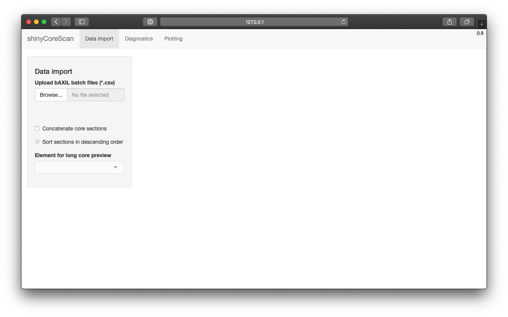
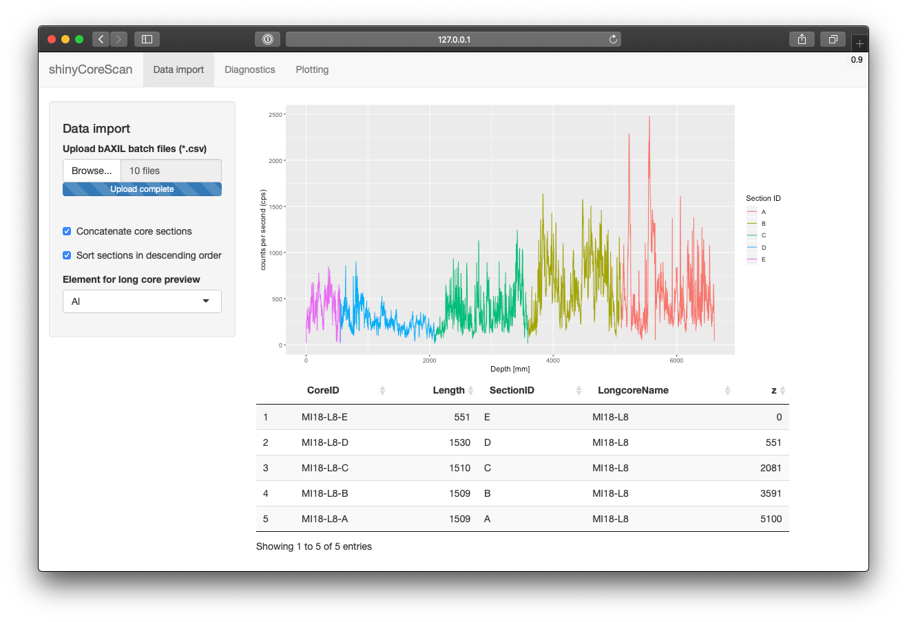
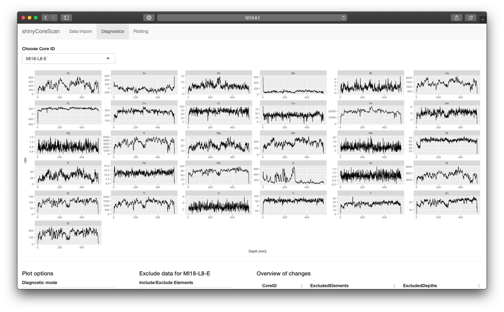
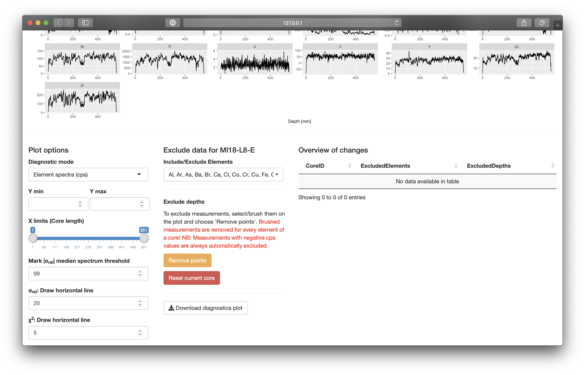
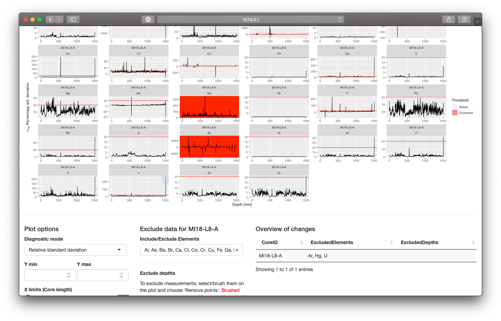
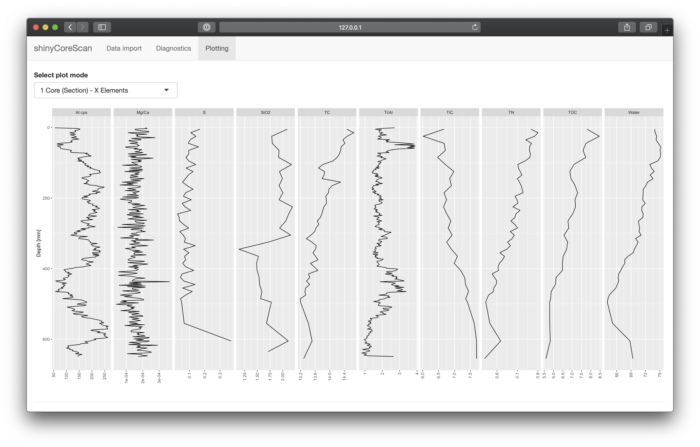
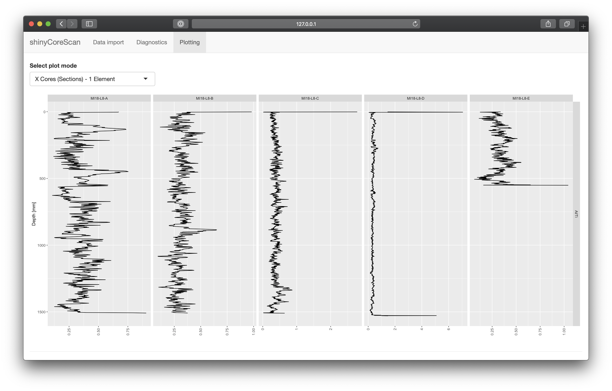
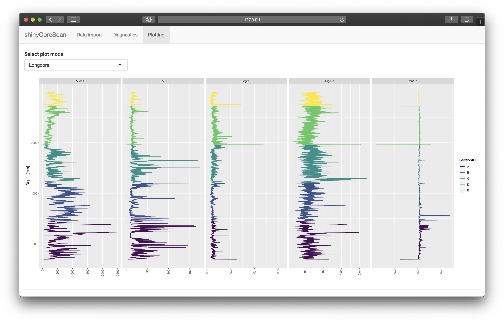
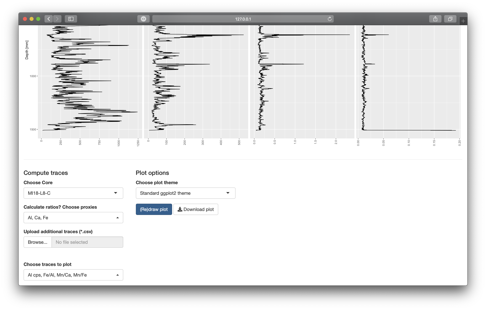

# shinyCoreScan

*This README applies to the newest shinyCoreScan release, which is as of now v0.9-beta. Older versions can be found in the [Wiki](https://github.com/blaidd4drwg/shinyCoreScan/wiki)*

*Die deutschsprachige Bedienungsanleitung befindet sich im [Wiki](https://github.com/blaidd4drwg/shinyCoreScan/wiki).*

shinyCoreScan is a WebApp written in R using the Shiny framework that processes Avaatech XRF Corescanner files (bAXIL batch csv files) and allows the inspection, cleaning, and plotting of XRF data.

## Getting Started

You can either run a local copy of shinyCoreScan using a [point release](https://github.com/blaidd4drwg/shinyCoreScan/releases) from the github project website or use the already deployed WebApp on [shinyapps.io](https://surfsedi.shinyapps.io/shinycorescan/). The two version are not necessarily at the same stage.

### Prerequisites for local deployment

For a local deployment of the WebApp you will need a recent [GNU R installation](https://www.r-project.org/) and for your own convenience [RStudio](https://rstudio.com/). Additionally, shinyCoreScan requires the following packages to be installed (listed in `global.R`):

```
library(shiny)
library(shinyjqui)
library(shinyjs)
library(reactlog)
library(shinyalert)
library(DT)
library(shinyWidgets)
library(shinycssloaders)
library(shiny.info)
library(readr)
library(tidyr)
library(dplyr)
library(ggplot2)
library(stringr)
library(viridis)
library(purrr)
library(tibble)
library(DT)
```

## Using shinyCoreScan

shinyCoreScan is divided in different tabpanels: Import, Diagnostics, Plotting et cetera. Using the Diagnostics panel for data inspection and cleaning is not mandatory but strongly advised.

### Import page

The import page allows the user to import their XRF Corescanner files (bAXIL batch csv files). Make sure that every file only contains data of one core (or core section). In case the import fails check if there are duplicate spectrum files (spe files created by bAXIL scanning software).



During import, the data of the input files is being reshaped and cleaned:

* The offset at the beginning of each core (stemming from the step chosen in the scanning software e.g. to skip the "green stuff" used to cap the top of core sections) is removed, i.e. the depth is zeroed. However, in order to possibly concatenate core sections, a value of 1 mm is added. In practice, this unlikely poses any problems.
* In case of multiple element traces at different voltages (e.g. the same element in the models for 10 kV and 30 kV), the element trace with the weaker signal (i.e. Area) is removed. This is to maintain uniqueness of key - value pairs during data transformation.
* The Rhodium element traces are discarded as (only) they require the usage of an additional variable to cover the type of spectrum recorded (incoherend vs. coherent) and are rarely used by the author.
* Repeated measures are removed, as they are difficult to deal with, especially since they are usually only done in intervals and the bAXIL batch files already contain statistical information for each measurement (standard deviation of Area or cps during measuring time).

Import and processing of the XRF files may take a minute. After the import is finished (progress bar disappears), the data is available for further processing. You can choose to `concatenate core sections` in the import panel on the left. This only works for valid longcores. The naming scheme for longcores is as follows:

```
.+(?=\\W[[:alpha:]]+)
```

This means, that The name of the long core (e.g. MI18-L8) needs to be followed by a non-word (e.g dash or underline) and then followed by the section at the end, which has to be a letter. E.g. MI18-L8-A ... MI18-L8-E would be valid names of a longcore.

If `concatenate core sections` is chosen with either ascending or descending order of sections, an Element can be chosen in the import panel to preview the spectrum over the whole longcore length `z`. A table shows information about the length of each section, their `SectionID`, the name of the longcore and the absolute, cumulative length/depth `z`. Choosing this mode is necessary to plot longcores on the Plotting page.



### Diagnostics page

The diagnostics page is used to inspect the XRF data and to clean it, i.e. remove spurious data.



The diagnostics are done for every core (or core section) individually, the `CoreID` can be changed in the upper left part of the page. Changes done to the data are automatically applied and saved.

Below the plot output, there are different inputs that control the plot and data.



1. First column: Plot options

* The `diagnostics mode` control offers three different modes.

  * `Element spectra (cps)`: Shows all available elements with their respective specta using cps (counts per second). Useful to get a first overview of the data.
  * `Relative standard deviation`: Shows the computed relative standard deviation in percent (relative to cps). This is particularly useful to see elements with high noise (relative standard deviation high in whole spectrum) and to detect outliers (either only for specific elements or in all elements).
  * `Goodness of fit`: Shows the goodness of the fit (Chi square value) that was reached when the XRF model was fitted to the spectrum. Lower is better, ideally below 5-10. High values/noise suggest a problem with peak deconvolution (e.g. overlapping XRF absorption lines), sharp peaks suggest problems with a measurement or gaps in the surface of the core.

* `Y min` and `Y max` can be used to change the range of the Y axis for each plot facet.
*  `X limits` does the same for the X axis.
*  `|σ rel| median spectrum threshold` allows to mark all elements that have an absolute relative standard deviation with a median (over the whole spectrum) above the given value. A good way to see all noisy elements at once.
*  `σ rel horizontal line` can be used to draw a line in the relative standard deviation plot to see high values more clearly.
*  `χ2 horizontal line` can be used to draw a line in the goodness of fit plot to see high values more clearly.

2. Second column: Cleaning/excluding data

* `Include/Exclude elements` allows to exclude elements that have noisy spectra or are not of concern. You should generally exclude elements with spectra that are not trustworthy (e.g. poor goodness of fit and high errors).
* To exclude depths, you can draw a rectangle around points to exclude with the crosshair cursor (+) and then press the button `Remove points`. Excluded depths are removed for every element of a core (section)!
* To include **all** previously excluded depths, i.e. to reset the settings, use `Reset current core`.

**Warning**: If you switch from one core (section) to another one, the excluded depths and elements will be reset, if they already exist. It is thus a good idea to process the core sections in order.


*Screenshot showing data cleaning for core MI18-L8-A. The elements Ar, Hg and U were excluded and an outlier in the spectrum of Y was marked with a box, ready to be removed.*

Once you are done with data inspection and cleaning, you can proceed to the next pages of shinyCoreScan.

### Plotting page

The plotting page currently offers three different ways/modes (top left switch) to compute and plot corescanner data:

* `1 Core (Section) - X Elements` is the default mode and allows to calculate element proxies and also to add additional traces (measurements such as ICP-OES, water content, TC/TIC/TOC content et cetera.) to plot together for one core (or core section).



> Requirements for additional traces: The input files have to be valid csv files that are separated by semicolon (;) - this is the default setting for csv files exported from Microsoft Excel. The first column needs to be called "Depth" and contain the sample depths in cm. The column headers of further columns are interpreted as variables (see Screenshot above).

* `X Cores (Sections) - 1 Element` is an alternative mode that allows the comparison of different cores or sections for one element (or element ratio). In this mode, no additional traces can be added.



* `Longcore` is an option that is only shown if the core is a valid longcore and `concatenate core sections` has been enabled on the import page. In this mode, different elements (and element ratios) can be plotted for the whole core. The sections of the longcore are marked with different colours.



The controls below the plot area allow the computing of proxies/element ratios and the upload of additional traces. The computed traces can then be selected and a redraw of the plot can be triggered by pushing `(Re)draw plot`. Moreover, the plot theme can be changed and the active plot can be downloaded.



